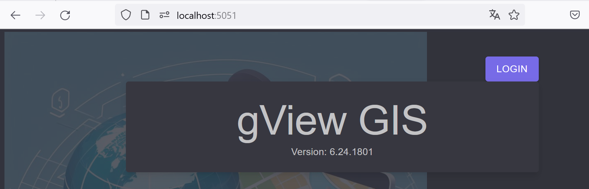
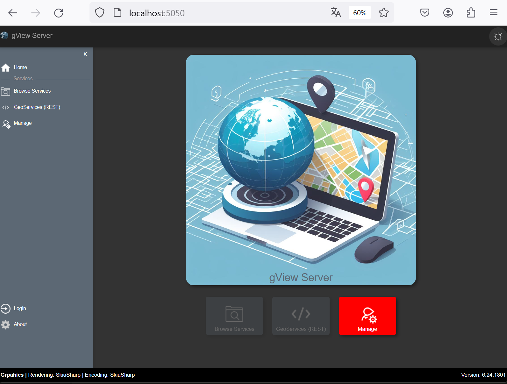

Run Locally (Desktop Mode)
==========================

Both *gView.Web* and *gView.Server* can be launched locally on the desktop.

Using *gView.Server* locally mainly makes sense for testing purposes.

.. note::

    However, a possible use case could be to use the *gView.Server* within an offline solution. 
    For this, the following components must be available on the offline devices:

    * Map server (*gView.Server*)
    * All necessary data (e.g., in a SQLite database)
    * A WebGIS solution that displays maps through the map server.

Since *gView.Web* replaces the previous desktop applications *gView.Carto* and *gView.DataExplorer*, 
it may make sense to only start this application when needed.

To do this, you need to change to the directory where the application was deployed in the previous step
(here: C:\\apps\\gview-gis\\local\\6.24.1801)

.. note::

    The last two subdirectories correspond to the profile and version number of the previously
    created *deployment*.

In this directory, the following files and folders should be present:

.. image:: img/run01.png

* ``gview-server.bat`` launches the *gView.Server* locally.
* ``gview-web.bat`` launches *gView.Web* (*gView.Carto*, *gView.DataExplorer*) locally.

When you start ``gview-web.bat``, you will see the following output:

.. image:: img/run02.png

Here, the URL under which the application should be accessed is displayed 
(here: http://localhost:5051).

.. note::

    The URL can be changed via the file ``gview-web.bat``. To do this, the file must be opened with a 
    text editor.

If you enter the URL in a browser (e.g., Firefox), the application should be displayed.

.. note::

    Some browsers automatically redirect ``http://`` requests to ``https://``. Unfortunately, this does not work 
    for *local* applications. This can be a reason why the application is not displayed.
    A solution can be to use a different browser (e.g., Firefox).

Since we defined a username and password during the *deploy* step, you must authenticate in 
the application to use the programs.

Click on Login and sign in as ``admin``. After that, all programs will be available:

.. image:: img/run04.png

.. note::

    The **Local gView Server** tile can only be successfully started if the server 
    has been started with ``gview-server.bat``.

.. note::

    The **Used Memory** tile is only meant to optimize memory usage when *gView.Web* 
    consumes many resources. Clicking on the symbol in the tile triggers a ``GC.Collect()``.

When you click on a tile, the corresponding application opens in the current browser tab.
If you want to open the application in a new tab, you must click on the arrow symbol in the 
corresponding tile.

When you start the file ``gview-server.bat``, the behavior is similar to the above.
The output will display the URL under which the *gView.Server* is running:

.. image:: img/run05.png

When you open the URL in the browser (here: http://localhost:5050), the following should be displayed:

.. note::

    When you access the *gView.Server* for the first time, usually no administrator user 
    is defined. The *gView.Server* operates independently of *gView.Web* and does not access 
    the user settings of this application.

    It is advisable to click on the red **Manage** tile after logging in and 
    enter a user and password here. This first user will then automatically become 
    the administrator for the gView Server.

