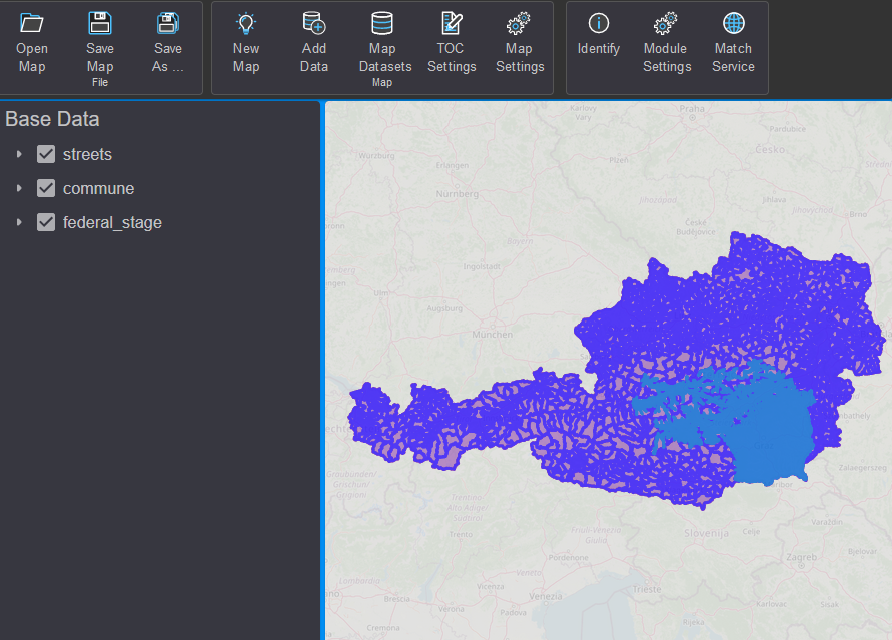

Add Data
========

When creating a map, the first step is to add data.
To do this, click on the ``Add Data`` button on the toolbar (or on the
quick access button in the TOC area).

.. image:: img/adddata1.png

The dialog is similar in navigation to the *gView.DataExplorer*. Instead of the
tree view of the Data Explorer, here a combo box ``Folder/Path`` is available.
The middle part of the dialog corresponds to the content area. However, unlike the *gView.DataExplorer*,
not all context menus are available here. For example, the *gView.DataExplorer* must always be used
for deleting and renaming objects.

.. image:: img/adddata2.png 

When first using the application, connections to data sources may need to be set up.
For example, if you want to incorporate *PostGIS* data (recommended), you must first navigate in the dialog to the ``Databases`` folder.
There, under the ``PostGIS`` subsection, all saved connections to *PostGIS Servers* are listed.
If no connections are available, a new connection can be created using the ``+`` button next to the ``Folder/Path``
selection field:

.. image:: img/adddata3.png

.. note::

    The button is only available to *Admin Users*. *Carto Users* only have access to connections provided by the *Admin*.

Before the connection is finalized, it can be verified with ``Test Connection`` to ensure
that all settings are correct and a connection can be established.

Once the connection has been successfully created, it can be opened with a double-click.

In the *Content Area*, *Feature Classes* or a *Dataset* can be selected and
then the dialog can be confirmed with ``OK``. This adds the data to the map 
and displays it:

In the TOC area, themes can be made visible or invisible (*Checkbox*). 
The *Arrow* button causes it to expand. Here, the legend is displayed for vector data layers:

.. image:: img/adddata5.png

