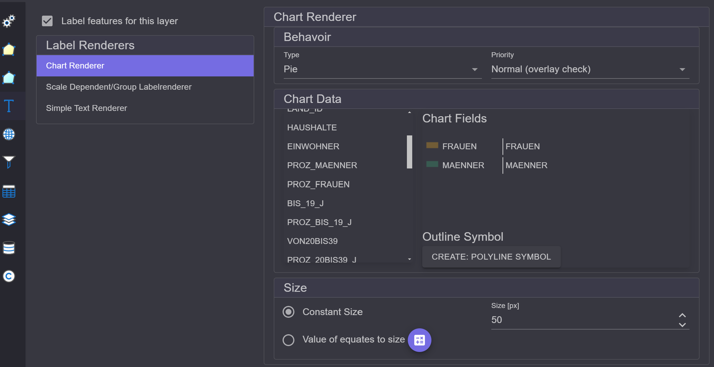

Label Renderer
==============

To label the features of a layer, the approach is similar to that used in *Rendering*. In the 
*Settings* dialog for the layer, on the left, you will find the section ``Label Renderer``. Here, 
the checkbox ``Label features for this layer`` must first be activated:

.. image:: img/labeling1.png

Different *Renderers* are offered here as well.

Simple Text Renderer
--------------------

With this renderer, features can be labeled based on attribute values. This represents the 
most common use case.

The properties of the *Renderer* are divided into the following categories:

* **Field / Expression:** Labeling can be done based on a field or an expression.
  For the ``Field`` type, simply select the field you want to label by:

  .. image:: img/labeling2.png
      :width: 400

  With ``Expression``, an expression can be defined. When you click on ``Edit Expression``, 
  the **Expression Editor** opens. Here, an expression can be specified that consists of free text
  and placeholders (field names in square brackets) for the fields:

  .. image:: img/labeling3.png
      :width: 400

  Field names are listed at the top. By double-clicking on a field, it is added as 
  a placeholder in the expression.

* **Behavior:** Here, the priority of the label is specified:

  .. image:: img/labeling4.png
       :width: 400

  When multiple layers are labeled, this is done in the drawing order of the layers. To highlight the labels 
  of a layer, the priority can be specified here. The reason is also that labels are only drawn if there 
  is space available on the map. Labels cannot overlap. Therefore, it is possible that a label is not drawn at all.
  Labels with higher priority have a better chance of being drawn.
  If the priority ``Always`` is given, it will always be drawn, regardless of overlaps.
  However, this can lead to illegible labels if too many texts overlap.

  ``How many labels`` indicates how often a text may occur:

   * ``One per feature``: Each feature is labeled exactly once.
   * ``One per part``: If the feature is a *multipart* feature, each part of the feature is labeled.
   * ``One per name``: If there are multiple features labeled with the same text,
     only the first is labeled. This prevents duplicate texts (for this layer) on the map.

* **Symbol / Cartography:** Here, the labeling symbol (font) can be set:

  .. image:: img/labeling5.png
      :width: 400

  Similar to feature symbology, there is also a **Symbol Composer** for text symbols here:

  .. image:: img/labeling6.png 
      :width: 400

  There is a ``Gallery`` with predefined symbols. Different types of symbols can be added via the ``Stack``:

  * ``Simple Text``: Just the text, no border
  * ``Glowing Text``: Text with a colored outline
  * ``Blockout Text``: Text within a colored rectangle

  .. note:: 

     **Glowing** and **Blockout** text improve the readability of text because they stand out better 
     against the background. On backgrounds like aerial images, normal texts are often 
     difficult to read.

* **Placement / Placement Priority:** For point and line themes, it may make sense to determine where 
  the label is placed. This can be controlled through ``Placement``:
  
  .. image:: img/labeling7.png
      :width: 400

  The center point would mean that the label is placed directly in the middle of the point or line.
  Through the priority, alternative positions can be assigned. If the label cannot be drawn due to 
  space constraints, the subsequent specified positions are applied in order until a positive result is achieved.

Scale Dependent/Group Layer Renderer
------------------------------------

Here, as previously with the **Scale Dependent (Feature) Renderer**, groups of *Label Renderers*
can be defined. This allows layers to be labeled differently at different scales.

For example, countries could be labeled with a country abbreviation at small scales.
As you zoom further into the map, they could be labeled with the full country name.

Chart Renderer
--------------

Here, instead of text, charts are inserted into the map:

* **Behavior:** Here, the type of chart can be specified (Pie, Bars, Stack).

* **Chart Data:** Here, fields can be dragged into the ``Chart Fields`` area.
  The chart is created from the field values of these fields.
  (Note: the first field must be dragged onto the title (``Chart Fields``).)
  If you want to remove a field, it can simply be dragged back to the left into the list.

* **Size:** Charts can have a fixed size, or the size can depend on the total sum.
  For this, a sum value and a size in pixels are entered. The size of the charts is then
  calculated relative to these values.

