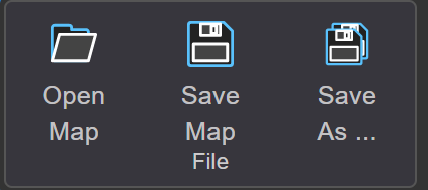
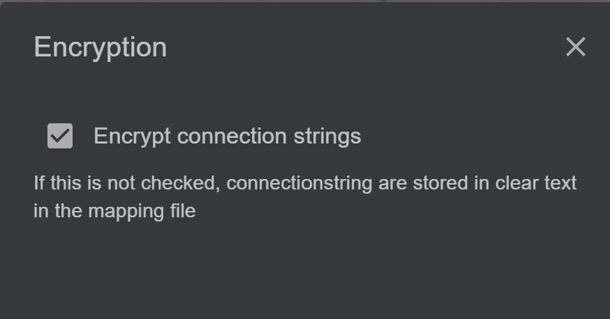

Saving and Managing Map Documents
=================================

Finally, the map should be saved. 
The following tools are available in the toolbar for this purpose:

Save
----

Saves the current map. If the map already exists, it is overwritten without comment.

Save As
-------

This allows a map to be saved with a new name or storage location. 

When saving a map with ``Save As``, the following dialog is displayed before saving,
provided that you are logged in as an administrator:

Normally, the connection properties to databases are encrypted in the MXL file. 
If one wants to change these properties in a text editor, it can be determined through the *checkbox*,
that the connection properties be saved in plain text.

.. note::

   For security reasons, connection properties should always be encrypted.
   However, this encryption is not 100% secure. *gView GIS* is an open-source software and
   anyone can learn and bypass the mechanism of this encryption.
   MXL files with confidential connection properties should therefore always be treated with care
   and not be distributed.

.. note::

   If you are an administrator and want to change the connection properties (*ConnectionString*) of
   *Dataset*, it can be done via the ``Map Datasets`` button in the toolbar:

   .. image:: img/save3.png

   Here, *ConnectionStrings* can be easily adjusted using ``Edit`` and ``Save``.
   With the ``Compress/Clean`` button, duplicate *Datasets* or *Datasets* without associated
   layers can be removed from the map.

A saved map in the ``mxl`` format can be seamlessly published via *gView Map Server*.
