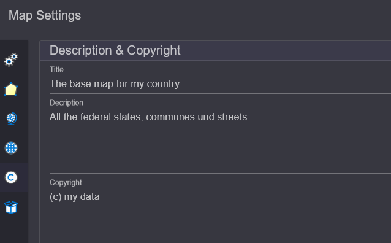

Creating a New Map
==================

Initially, a new map can optionally be created. This can be done via the ``New Map`` button or the quick start button in the TOC area:

.. image:: img/newmap1.png

In the dialog, a name for the new map can be assigned. By clicking ``Confirm``, 
the new map is created. The new name now appears instead of *map1* in the TOC area.

Map Settings
------------

Further settings can be made via the ``Map Settings`` button. 
The recently chosen name of the map can also be changed here later:

.. image:: img/newmap2.png

In the ``Display`` section, a reference scale can be set. If this value is greater than 
``0``, symbol and font sizes are based on this scale. Depending on the map scale, 
the symbols and labels will appear larger or smaller.

For most applications, *Map/Display Units* should be set to ``Meters``.
Without *Map Units*, the reference scale cannot be considered.

In the ``Current`` section, the coordinates of the current map view are displayed, based on
the currently set coordinate system. The size of the map image is also shown.
This information is often helpful when testing services on the **gView.Server**.

Links im Dialog werden noch weiter Einstellungsseiten angeboten:

Additional setting pages are offered on the left side of the dialog:

Appearance
++++++++++

This page can be used to determine the smoothing mode for symbols and labels. Clicking on one of 
these buttons applies the selected mode to all layers currently inserted in the map:

.. image:: img/newmap3.png

Spatial Reference (System)
++++++++++++++++++++++++++

Here, the spatial reference system for the map can be assigned. The coordinate system in which 
the data is predominantly stored should be set. To change the coordinate system, click on ``Select``. 
In the dialog, enter the name or EPSG code of the desired coordinate system in the search field 
and then click on the desired item in the list. This will adopt the coordinate system:

.. image:: img/newmap4.png

.. note::

    The coordinate system in which data is displayed in **gView.Carto** always corresponds 
    to that of the transparent background TileCache. Therefore, a change here will not be 
    immediately apparent in the display.

    However, the coordinates displayed in the status bar will change. This setting is also 
    relevant when the map is later published on the **gView.Server**. All coordinates and 
    *BoundingBox* values in the service properties refer to the coordinate system set here.

Another point in this dialog is ``Spatial Behavior``.
This setting determines how the service should behave later when it is accessed in the
*WebMercator* system. Typically, the scale is calculated without considering distortion. 
No matter where you are on the map, the calculated scale corresponds to the scale at the equator. 
Since the north/south distortion in the *WebMercator* can be significant,
this is not always desirable. If you set ``Include Latitude When Calculating Map Scale`` instead 
of ``default``, the geographic latitude is considered when calculating the internal scale 
(factor ``cos(lat)``).

Default Layer Spatial Reference (SRef)
++++++++++++++++++++++++++++++++++++++

When adding data to the map later, it may happen that some layers lack information 
about the coordinate system the data are in. This should not be the norm, but 
if this problem occurs, a ``Default Coordinate System`` can be set here.
For all layers without specified coordinates, this will be used:

.. image:: img/newmap5.png

.. note::

    This setting should only be necessary in exceptional cases. Normally, it is important 
    that all layers have information about their coordinate system.

Description & Copyright
+++++++++++++++++++++++

Under this section, a descriptive title for the map as well as a description and 
copyright notices can be specified. These will later appear as metadata in the 
**gView.Server** services:

Resources
+++++++++

Here, binary objects can be passed to the map. These will later be stored within the
map document. No large files should be stored here, as this would make the map document very large.

One use case is small PNG graphics that will later be used as symbols (*RasterSymbol* for points). 
The symbols can also be set as a path to the image. However, the disadvantage is that the same path 
must also be available on the server where **gView.Server** is running. If the image is specified here, 
it can later be referred to in *RasterMarkerSymbol*. If the symbol is stored in the map document, 
identical paths are not necessary.

.. note::

    Another way to display symbols is through *True Type Fonts* (recommended method). 
    These cannot be uploaded and used here. The fonts must also be installed on the 
    **gView.Server** server.
 

