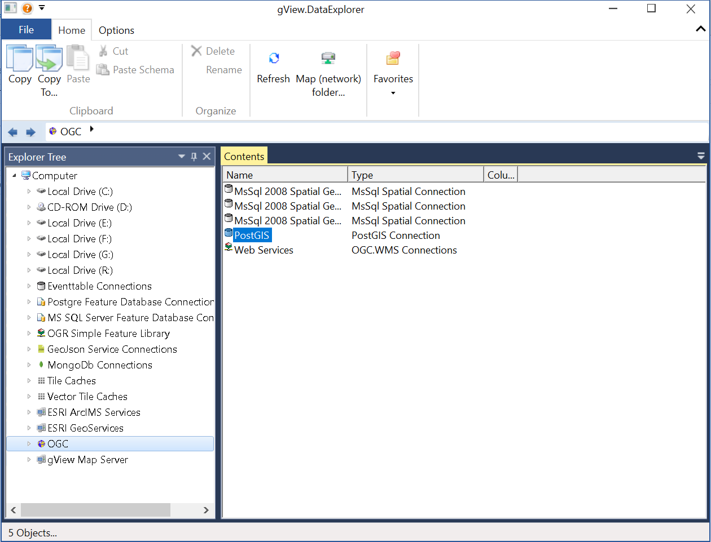
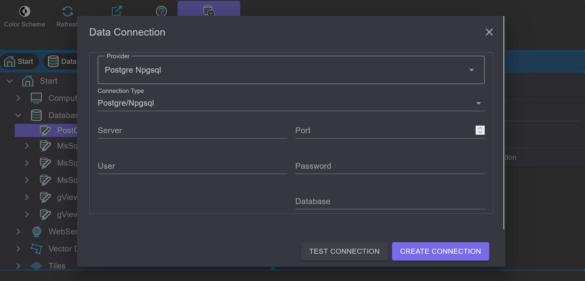

Database Connections
========================

With *gView.DataExplorer*, connections to geospatial data sources can be managed and the data can be 
visualized in a simple manner.

File-based data sources can be easily displayed by navigating to the respective directory in the filesystem.

For databases, connections must first be created. Here, an example is shown of how to establish a connection 
to a PostGIS database.

.. note::
   Connections created in *gView.DataExplorer* are also available in *gView.Carto* when inserting data.

PostGIS databases are integrated through the ``Databases`` node:

Under ``PostGIS``, all existing connections are listed. With ``New Connection``, a new connection can be created:

After entering the connection parameters, you can use ``Test Connection`` to verify whether a connection can be established 
before creating it. After confirming the dialog with ``OK``, the connection is established and appears in the list. 
A double-click on the connection opens it and lists the layers in the database.

Using the tools in the context area of the toolbar, a connection can be renamed or deleted. 
With the ``Connection String...`` button, the connection parameters can be modified afterwards.

.. note::
   When data is integrated via a database connection using *gView Carto*, all connection parameters are stored in the 
   MXL file. Changes made to the connection parameters in *gView DataExplorer* will not affect existing *gView Carto* 
   maps that have already been created.

