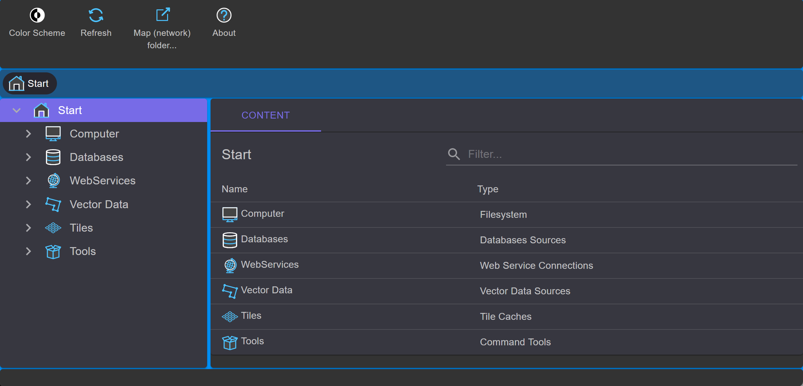

gView Data Explorer
===================

The program is similar to Windows Explorer, but is specifically designed for administration 
of geodata. After startup, the following window appears:

On the left, the file system and the connections to various data sources are displayed in a tree structure. 
The center part of the window (*Contents*) always displays the contents of the respective node.

.. toctree::
   :maxdepth: 2
   :caption: Table of contents:

   connections
   fdb/index

