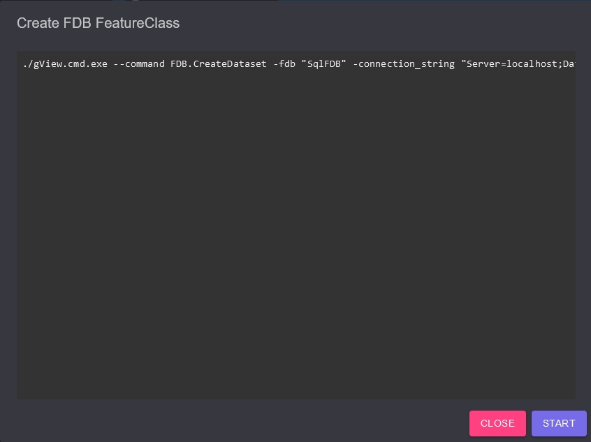

.. _commandline-tools:

gView Kommandozeilenwerkzeuge
=============================

Hier werden einige Kommandozeilenwerkzeuge für *gView GIS* vorgestellt, um wiederkehrende Vorgänge 
zu automatisieren. Die Kommandozeilenwerkzeuge befinden sich im Installationspfad im Verzeichnis 
``web``. Dieser absolute Pfad muss den hier gezeigten Kommandos immer vorangestellt werden, oder es 
muss ein Verweis über die ``PATH``-Umgebungsvariable erstellt werden.

Die **gView.WebApps** bzw. der **gView.DataExplorer** nutzen die Kommandozeilenwerkzeuge teilweise,
weshalb sie auch in diesem Pfad gefunden werden können. Wenn die **gView.WebApps** Kommandozeilenwerkzeuge 
aufrufen, erkennt man dies an Dialogen wie diesem:

Hier werden die Kommandozeilen angeführt, die für die gewünschte Aktion ausgeführt werden müssen.
(hier beispielsweise ein Skript zum Anlegen eines *Feature Datasets* in der *gView Feature Database*).
Mit dem ``Start``-Button werden die Kommandos ausgeführt und die Ausgabe in dieses Fenster umgeleitet.

.. note::

   Der Vorteil des Anzeigens der Kommandos ist, dass die Kommandos aus diesem Dialog als 
   Text markiert und kopiert werden können. Dadurch können die Befehle später direkt am Server 
   ausgeführt werden. Wiederkehrende Aufgaben können so einfach automatisiert werden.

gView Kommandozeilenwerkzeug aufgerufen
---------------------------------------

Der Aufbau der Kommandozeilenwerkzeuge ist immer gleich. Der Einstiegspunkt ist das 
Kommandozeilenwerkzeug **gView.Cmd.exe**. Ruft man das Tool ohne weitere Parameter auf, erhält man 
etwa folgende Ausgabe:

.. code-block:: batch

   >> .\gView.Cmd.exe
      Usage: gView.Cmd --command [command] [...arguments...]
             gView.Cmd --command [command] --help

      Use one of the following commands:
      ElasticSearch.Fill:             Fills an ElasticSearch index using defintion from an json file
      FDB.CreateDataset:              Creates a new gView Feature Database FeatureClass
      FDB.CreateFeatureClass:         Creates a new gView Feature Database FeatureClass
      FDB.CreateNetworkClass:         Creates a new gView Feature Database NetworkClass
      FDB.ImageDatasetUtil:           Working wigh FDB Image Datasets
      FDB.RebuildSpatiallIndexDef:    Rebuild spatial index of a featureclasses
      FDB.RepairSpatialIndex:         Repair spatial index of a featureclasses
      FDB.ShrinkDatasetSpatialIndex:  Shrink spatial index of all featureclasses in a dataset
      FDB.ShrinkFeatureClassSpatialIndex:  Shrink spatial index of a featureclasses
      FDB.TruncateFeatureClass:       Truncate featureclasses
      LuceneServer.Fill:              Fills a lucene server index using defintion from an json file
      MxlUtil.FromGLStylesJson:       Creates a MXL file from a (TileCache) styles json definition
      MxlUtil:                        Run a mxl uitilty
      TileCache.ClipCompact:          Clips a tile compact cache by polygon(s)
      TileCache.Render:               Forces a gView Server instance to render service a tile cache

Um ein spezielles Kommando aufzurufen, muss das Kommando immer mit dem Parameter ``--command`` übergeben 
werden:

.. code-block:: batch

   >> .\gView.Cmd.exe --command TileCache.Render
      ERROR: parameter server is required

Übergibt man einem Kommando nicht alle notwendigen Parameter, wird das Programm abgebrochen.
Hier wird der erste notwendige Parameter mit der Fehlermeldung ``parameter required`` angeführt.

Möchte man alle Parameter angezeigt bekommen, die für ein Kommando notwendig sind, übergibt man 
noch den Parameter ``--help``:

.. code-block:: batch

   >> .\gView.Cmd.exe --command TileCache.Render --help
      Help: TileCache.Render
      Forces a gView Server instance to render service a tile cache
      Usage:
      -server: gView Server Instance, eg. https://my-server/gview-server
      -service: The service to pre-render, eg. folder@servicename
      -epsg: EPSG Code [default: first]
      -compact: create a compact tile cache
      -orientation: Orientation of origin [default: UpperLeft]
      -imageformat: Imageformat: <png|jpg>
      -bbox_minx: Minimum X Coordinate
      -bbox_miny: Minimum Y Coordinate
      -bbox_maxx: Maximum X Coordinate
      -bbox_maxy: Maximum Y Coordinate
      -scales: Scales to render <scale-dominator1,scale2-dominator2> [default: all scales]
      -threads: Maximum parallel requests [default: 1]

Kommandozeilenwerkzeuge (Interaktiver Modus)
============================================

**gView.Cmd.Exe** kann auch im sogenannten interaktiven Modus gestartet werden. Dazu reicht 
folgender Aufruf:

.. code-block:: batch

   >> .\gView.Cmd.exe -i
      Interactive mode: type command with arguments
      Usage: [command] [...arguments...]
             [command] --help
             help ... show this message
             quit ... quit programm
             clear ... clear console window

      Use one of the following commands:
      ElasticSearch.Fill:             Fills an ElasticSearch index using defintion from an json file
      FDB.CreateDataset:              Creates a new gView Feature Database FeatureClass
      FDB.CreateFeatureClass:         Creates a new gView Feature Database FeatureClass
      FDB.CreateNetworkClass:         Creates a new gView Feature Database NetworkClass
      FDB.ImageDatasetUtil:           Working wigh FDB Image Datasets
      FDB.RebuildSpatiallIndexDef:    Rebuild spatial index of a featureclasses
      FDB.RepairSpatialIndex:         Repair spatial index of a featureclasses
      FDB.ShrinkDatasetSpatialIndex:  Shrink spatial index of all featureclasses in a dataset
      FDB.ShrinkFeatureClassSpatialIndex:   Shrink spatial index of a featureclasses
      FDB.TruncateFeatureClass:       Truncate featureclasses
      LuceneServer.Fill:              Fills a lucene server index using defintion from an json file
      MxlUtil.FromGLStylesJson:       Creates a MXL file from a (TileCache) styles json definition
      MxlUtil:                        Run a mxl uitilty
      TileCache.ClipCompact:          Clips a tile compact cache by polygon(s)
      TileCache.Render:               Forces a gView Server instance to render service a tile cache
   Command:>

Der Vorteil im interaktiven Modus ist, dass das Programm nicht geschlossen wird. Hier können direkt 
Kommandos eingegeben werden. Ein vorangestelltes ``gView.Cmd.exe --command`` entfällt.
Neben den eingegebenen Kommandos gibt es im interaktiven Modus noch folgende Befehle:

* **help**: Gibt die Liste der Kommandos und eine kurze Beschreibung aus.
* **quit**: Beendet **gView.Cmd** und den interaktiven Modus.
* **clear**: Löscht den Inhalt des Konsolenfensters.

Der Aufruf eines Kommandos im interaktiven Modus sieht in etwa wie folgt aus:

.. code-block:: batch

   Command:>LuceneServer.Fill --help
      Help: LuceneServer.Fill
      Fills a lucene server index using defintion from an json file
      Usage:
      -json: Json File with import definition
      -package-size: optional: number of items sended to lucene server per request (default 50000)
      -basic-auth-user: optional: User for basic authentication
      -basic-auth-pwd: optional: User password for basic authentication
      -proxy-url: optional: a proxy server
      -proxy-user: optional: a proxy server user
      -proxy-pwd: optional: a proxy server user password
   Command:>LuceneServer.Fill -json "c:\temp\...." -package-size 25000
   ...

Im Folgenden werden einige Kommandozeilenwerkzeuge beispielhaft beschrieben:

.. toctree::
    :maxdepth: 1
    :caption: Inhaltsverzeichnis:
 
    render_tile_cache
    mxlutil
    
    