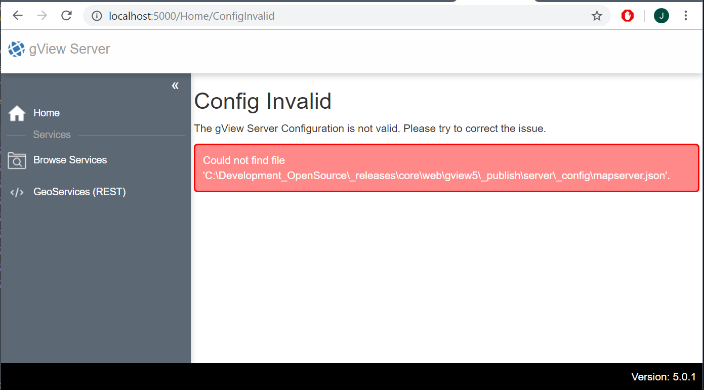

.. _server_postinstallation:

Postinstallation
================

Nach der Installation des gView Servers folgt die Postinstallation. Beim ersten Aufruf des Servers 
über den Browser wird eventuell folgende Meldung angezeigt:

Diese Fehlermeldung zeigt, dass die Konfiguration des Servers noch nicht korrekt ist.
Im Beispiel hier existiert die Datei ``_config/mapserver.json`` noch nicht. Die Form und Funktion 
dieser Datei wird im Abschnitt :ref:`config-server` gezeigt.

Nach erfolgreicher Konfiguration erscheint die Anwendung nach dem ersten Aufruf folgendermaßen:

.. image:: img/postinstallation2.png

Der rote Button ``Manage`` zeigt an, dass noch kein Administrator angelegt wurde. Der **gView Server**
benötigt einen Administrator Benutzer, der **Logins** und **Folder** (Verzeichnisse für Kartendienste)
anlegen darf.

Solange diese Schaltfläche rot ist, muss dieser Administrator angelegt werden. Zum Anlegen des
Administrators auf die rote Kachel klicken und einen Benutzernamen und ein Passwort für den
Administrator vergeben:

.. image:: img/postinstallation3.png

Ist das Passwort nicht stark genug, muss eventuell ein stärkeres Passwort angegeben werden.
Nach erfolgreichem Anlegen des Administrators wechselt die Oberfläche in den **Manage** Bereich 
des gView Servers. Diese ist nur für den Administrator nach erfolgreicher Anmeldung sichtbar:

.. image:: img/postinstallation4.png

