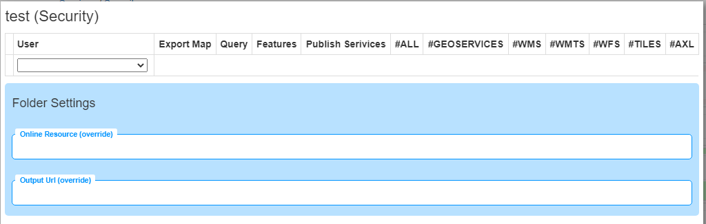

gView Server Verwalten
======================

Zum Verwalten des *gView MapServer* wurde unter :ref:`server_postinstallation` bereits ein 
Administrator Account angelegt.

Mit diesem User können:

- neue Verzeichnisse angelegt werden
- Dienste über die Web-Oberfläche publiziert werden
- Dienste gestoppt und wieder gestartet werden
- Logdateien der Dienste angezeigt werden
- Clients angelegt werden.

Anmelden als Administrator
--------------------------

Die Anmeldung erfolgt über den Link ``Manage`` aus der Sidebar:

.. image:: img/manage1.png

Manager Benutzeroberfläche
--------------------------

Ist man als Administrator angemeldet, erscheint die Manager Benutzeroberfläche etwa folgendermaßen:

.. image:: img/manage2.png 

Links werden die Verzeichnisse (Folder) angezeigt, in denen Services organisiert sind. 
Daneben werden die Services angezeigt, die sich in diesem Verzeichnis befinden.

Clients Anlegen
---------------

**Clients** sind bekannte *WebAnwendungen*, die auf die Dienste im **gView MapServer** zugreifen. 
Greift etwa eine WebGIS Anwendung auf Dienste zu, kann dafür ein *Client* erstellt werden.
Jeder **Client** besitzt ein **Secret**, um sich bei Zugriffen am **gView MapServer** anzumelden. 
**Client** und **Secret** sind ähnlich wie **User** und **Passwort** zu verstehen, nur dass
ein **Client** in der Regel keine physische Person, sondern eine Anwendung ist.

.. note::

   Möchte man später nur bestimmten Anwendern Zugriff auf bestimmte Dienste geben, muss es
   in der jeweiligen **Client** Software (WebGIS) eine eigene Autorisierungsschicht geben.

In der Manager Benutzeroberfläche kann oben zwischen ``Services`` und ``Security`` gewechselt werden. 
Unter Security können neue *Clients* angelegt bzw. bestehende *Secrets* geändert werden:

.. image:: img/manage3.png

Dienstberechtigungen
--------------------

Grundsätzlich sollten Services mit gleichen Eigenschaften (produktiv/test, spezielle Berechtigungen) 
innerhalb von **Foldern** organisiert werden. 
Berechtigungen können dann auf Ebene der *Folder* gesetzt werden und gelten für alle Services 
innerhalb des **Folders**. Alternativ müssen Berechtigungen einzeln für jeden Dienst 
eingestellt werden.

.. note::
   Berechtigungen sind hierarchisch organisiert. Ist ein Recht über den *Folder* nicht möglich, 
   steht dieses auch nicht in einem Dienst in diesem *Folder* zur Verfügung. 
   Durch eine zusätzliche Berechtigung eines Dienstes innerhalb einer Gruppe kann nur weiter 
   eingeschränkt werden.

Ob für einen Dienst oder einen **Folder** Berechtigungen gesetzt wurden, erkennt man am 
*Schloss-Symbol*. Ist das Schloss geöffnet, wurden bisher keine Berechtigungen gesetzt. 
Alle Dienste stehen dann jedem Benutzer zur Verfügung.

Klickt man beispielsweise für einen **Folder** auf das *Schloss-Symbol*, öffnet sich folgender Dialog:

Hier sind noch keine Berechtigungen gesetzt, das heißt jeder Benutzer/Client darf alle Dienste 
in diesem *Folder* uneingeschränkt nutzen.

.. note::
   Eine Ausnahme ist hier das *Publish Service* Recht. Das kann nur einem Client zugewiesen werden. 
   Nur berechtigte Clients und der Administrator können Dienste veröffentlichen.

* **Export Map**: Kartenbilder dürfen für beliebige Ausschnitte abgeholt werden.
* **Query**: Geo-Objekte können abgefragt und gesucht werden.
* **Features**: Geo-Objekte können als Features heruntergeladen oder bearbeitet werden. 
  Dies setzt als Schnittstelle *GeoServices REST* voraus. Welche Geo-Objekte bearbeitet werden dürfen, 
  wird im Kartenprojekt (MXL) über *gView Carto* im *Ribbon* unter *Options* eingestellt.
* **Publish Service**: Dienste dürfen für dieses Verzeichnis veröffentlicht und gelöscht werden.
* **Schnittstellen**: Berechtigungen können hier für bestimmte Schnittstellen (WMS, ...) 
  eingeschränkt werden.

In der Auswahlliste kann ein bestehender Client ausgewählt werden. Eine Sonderstellung hat dabei der 
Client ``_anonymous``, der automatisch immer in der Auswahlliste angeboten wird.
Dieser *Client* wird immer als Berechtigung herangezogen, wenn keine 
Anmeldung durch die *Client* Anwendung erfolgt. Für diesen *Client* kann etwa folgendes 
eingestellt werden:

.. image:: img/security2.png 

Das bedeutet, dass ein **anonymer Client** für die Dienste in diesem **Folder** Kartenbilder abholen 
und Geo-Objekte abfragen darf. Für die Dienste stehen aber nur die 
Schnittstellen ``WMS`` und ``WMTS`` zur Verfügung.

Im nächsten Schritt können Clients speziellere Rechte übertragen werden:

.. image:: img/security3.png 

Wie oben ersichtlich können in diesem Dialog noch weitere Werte für den Folder eingegeben werden 
(``Online Resource (override)`` und ``Output Url (override)``).
Damit können die Werte aus der ``_config/mapserver.json`` überschrieben werden. Das kann nützlich sein, 
wenn ein Server vom Internet über unterschiedliche Urls erreichbar ist oder Dienste eines 
**Folders** über eine Proxy publiziert werden. In der Regel können diese Werte leer gelassen werden.

Status von Diensten
-------------------

Dienste können zur Laufzeit einen bestimmten Status aufweisen. Dieser ist in der *Manage* 
Benutzeroberfläche in der Liste der Dienste ersichtlich (siehe oben):

* **Idle**: Der Dienst erscheint in der Liste "weiß". Der Dienst steht zwar zur Verfügung, 
  wurde allerdings noch nicht durch einen Client gestartet/aufgerufen.
* **Running**: Der Dienst wurde initialisiert und läuft (grün).
* **Stopped**: Der Dienst wurde vom Administrator gestoppt. Für Clients ist der Dienst nicht mehr 
  sichtbar. In der Manage-Benutzeroberfläche wird der Dienst transparent dargestellt.

Zusätzliche Farben:

* **Rot**: Der Dienst hat seit dem letzten Start Fehler verursacht.

Bei jedem Dienst stehen auch Befehlsbuttons zur Verfügung, über die beispielsweise der Status 
beeinflusst werden kann:

.. image:: img/status1.png 

* **Logs**: (Error) Logs für diesen Dienst anzeigen
* **Security**: Berechtigungen für diesen Dienst setzen
* **Start**: Dienst starten (falls gestoppt)
* **Stop**: Dienst stoppen (ist danach nicht mehr für Clients sichtbar)
* **Refresh**: ein Neustart des Dienstes wird erzwungen

