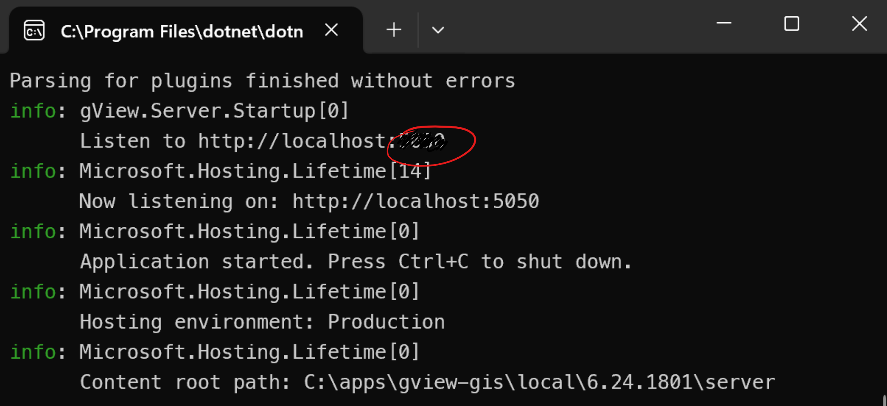

Lokal ausführen (Windows Desktop Modus)
=======================================

Sowohl *gView.WebApps* als auch *gView.Server* können lokal auf dem Desktop gestartet werden.

Der Einsatz von *gView.Server* lokal macht hauptsächlich für Testzwecke Sinn.

.. note::

    Ein möglicher Anwendungsfall wäre jedoch, den *gView.Server* innerhalb einer Offline-Lösung 
    zu verwenden. Dazu müssten auf den Offline-Geräten folgende Komponenten vorhanden sein:

    * Kartenserver (*gView.Server*)
    * Alle notwendigen Daten (z.B. in einer SQLite-Datenbank)
    * Eine WebGIS-Lösung, die über den Kartenserver Karten darstellt.

Da *gView.WebApps* die früheren Desktop-Anwendungen *gView.Carto* und *gView.DataExplorer* ablöst, kann 
es sinnvoll sein, diese Applikation nur bei Bedarf zu starten.

Dazu muss man in das Verzeichnis wechseln, in dem im vorherigen Schritt die Anwendung *deployed* wurde
(hier: C:\\apps\\gview-gis\\local\\6.24.1801)

.. note::

    Die letzten beiden Unterverzeichnisse entsprechen dem Profil und der Versionsnummer des zuvor
    erstellten *Deployments*.

In diesem Verzeichnis sollten sich folgende Dateien und Ordner befinden:

.. image:: img/run01.png

* ``gview-server.bat`` startet den *gView.Server* lokal.
* ``gview-web.bat`` startet *gView.WebApps* (*gView.Carto*, *gView.DataExplorer*) lokal.

Wenn man ``gview-web.bat`` startet, erhält man folgende Ausgabe:

.. image:: img/run02.png

Hier wird ausgegeben, unter welcher URL die Anwendung aufgerufen werden soll 
(hier: http://localhost:45623).

.. note::

    Die URL kann über die Datei ``gview-web.bat`` geändert werden. Dazu muss die Datei mit einem 
    Texteditor geöffnet werden.

Wenn man die URL in einem Browser eingibt (z.B. Firefox), sollte die Anwendung angezeigt werden.

.. image:: img/run03.png

.. note::

    Manche Browser leiten ``http://``-Anfragen automatisch auf ``https://`` um. Dies funktioniert leider
    nicht für *lokale* Anwendungen. Das kann ein Grund sein, warum die Anwendung nicht angezeigt wird.
    Abhilfe schaffen kann die Verwendung eines anderen Browsers (z.B. Firefox).

Da wir im vorigen Schritt beim *Deploy* Benutzername und Passwort definiert haben, muss man sich in 
der Anwendung erst authentifizieren, um die Programme nutzen zu können.

Dazu auf Login klicken und sich als ``admin`` anmelden. Danach stehen alle Programme zur Verfügung:

.. note::

    Die Kachel **Local gView Server** kann nur erfolgreich gestartet werden, wenn der Server 
    mit ``gview-server.bat`` gestartet wurde.

.. note::

    Die Kachel **Used Memory** dient nur dem Zweck, die Speicherbelegung zu optimieren, wenn *gView.WebApps*
    viele Ressourcen verbraucht. Ein Klick auf das Symbol in der Kachel führt ein ``GC.Collect()`` 
    aus.

Klickt man auf eine Kachel, wird die entsprechende Anwendung im aktuellen Browser-Tab geöffnet.
Möchte man die Anwendung in einem neuen Tab öffnen, muss man auf das Pfeilsymbol in der 
entsprechenden Kachel klicken.

Startet man die Datei ``gview-server.bat``, ist das Verhalten ähnlich wie oben beschrieben.
In der Ausgabe wird die URL angezeigt, unter der der *gView.Server* läuft:

Öffnet man die URL im Browser (hier: http://localhost:45622), sollte folgendes angezeigt werden:

.. image:: img/run06.png

.. note::

    Ruft man den *gView.Server* das erste Mal auf, sind in der Regel noch kein Administrator-User 
    definiert. Der *gView.Server* agiert unabhängig von *gView.WebApps* und greift nicht auf 
    die Benutzereinstellungen dieser Anwendung zu.

    Es empfiehlt sich, nach dem Einloggen auf die rote Kachel **Manage** zu klicken und 
    hier einen User und ein Passwort einzugeben. Dieser erste User wird dann automatisch 
    der Administrator für den gView Server.

