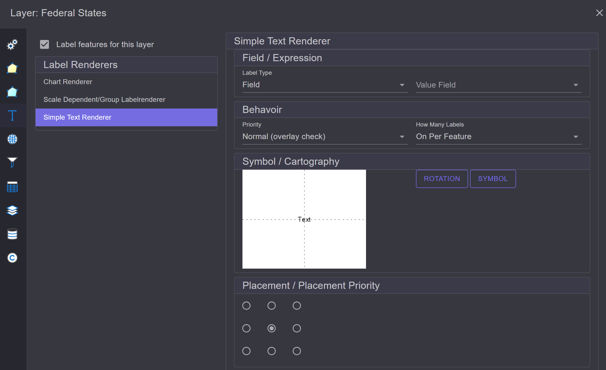
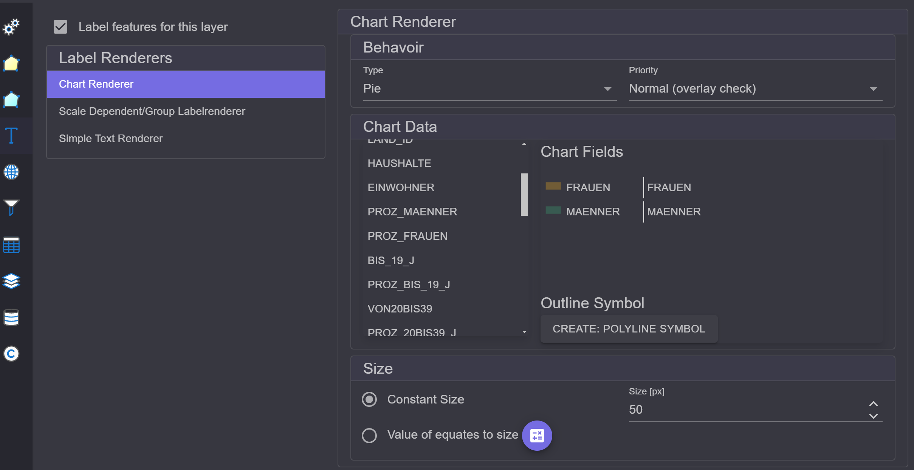

Label Renderer
==============

Um die Features eines Layers zu Beschriften geht man ähnlich vor, wie beim *Rendering*. Im 
*Settings* Dialog für den Layer findet man links den Abschnitt ``Label Renderer``. Hier muss 
zuerst die Checkbox ``Label features for this layer`` aktiviert werden:

Es gibt auch hier wieder unterschiedliche *Renderer* die angeboten werden.

Simple Text Renderer
--------------------

Mit diesem Rendere können Features nach Attributwerten beschriftet werden. Das stellt den 
häufigsten Anwendungsfall dar.

Die Eigenschaften des *Renderers* teilen sich die folgende Kategorien auf:

* **Feld / Ausdruck:** Es kann nach einem Feld oder nach einem Ausdruck beschriftet werden.
  Beim Typ ``Field`` kann einfach das Feld ausgewählt werden, nach dem beschriftet werden soll:

  .. image:: img/labeling2.png
      :width: 400

  Mit ``Expression`` kann ein Ausdruck definiert werden. Wenn man auf ``Edit Expression`` klickt, 
  öffnet sich der **Expression Editor**. Dort kann ein Ausdruck angegeben werden, der aus freiem Text
  und Platzhaltern (Feldname in eckigen Klammern) für die Felder zusammengesetzt ist:

  .. image:: img/labeling3.png
      :width: 400

  Im oberen Bereich stehen die Feldnamen. Durch einen Doppelklick auf ein Feld wird es als 
  Platzhalter im Ausdruck angefügt.

  Über *Expressions* können die Feldwerte auch formatiert werden. Eine Formatierung ist für 
  Nummern- und Datumsfelder möglich. Die Syntax für einen Platzhalter mit Formatierung ist dabei 
  folgende:

    ``[Feldname:Formatierung]``, z. B. ``[Feldname:0.00]`` für eine Zahl mit zwei Nachkommastellen.

  Beispiele:

  *Standard-Formate für Zahlen:* 

  .. list-table::
    :width: 100 %
    :header-rows: 1

    * - Zweck	
      - Format
      -	Platzhalter-Beispiel
      -	Ergebnis bei Value = 12345.678
    * - Feste Dezimalstellen 
      -	F2
      -	[BETRAG:F2]
      -	12 345,68
    * - Währung	
      - C	
      - [PREIS:C]	
      - € 12 345,68
    * - Tausendertrennzeichen, Standard	
      - N0	
      - [MENGE:N0]	
      - 12 346
    * - Prozent	
      - P1
      -	[ANTEIL:P1]
      - (Value = 0.256)	25,6 %
    * - Exponential	
      - E3	
      - [WERT:E3]	
      - 1,235E+004
    * - Hexadezimal (Integer)	
      - X8	
      - [ID:X8] 
      - (Value = 48879)	0000BEEF

    
  *Benutzerdefinierte Zahlenformate:*

  .. list-table::
    :width: 100 %
    :header-rows: 1

    * - Zweck 
      - Format-String 
      - Beispiel 
      - Ergebnis
    * - Zwei Dezimalen, Punkt als Trennzeichen 
      -  0.00 
      - [WERT:0.00] (12.3456) 
      -  12.35
    * - Max. zwei Dezimalen 
      - #.## 
      - [WERT:#.##] (12.3) 
      - 12.3
    * - Feste Breite, führende Nullen 
      - 00000 
      - [NR:00000] (42) 
      -  00042
    * - Tausenderpunkt, zwei Stellen 
      - #,##0.00 
      - [SUMME:#,##0.00] 
      - 12 345,68 

  *Standard-Formate für Datum/Zeit:*

  .. list-table::
    :width: 100 %
    :header-rows: 1

    * - Zweck 
      - Format -
      - Platzhalter-Beispiel 
      - Ergebnis bei Value = 2025-04-24 14:30
    * - Kurzdatum 
      - d 
      - [DATUM:d] 
      - 24.04.2025
    * - Langdatum 
      - D 
      - [DATUM:D] 
      - Donnerstag, 24. April 2025
    * - Datum + kurze Zeit 
      - g 
      - [DATUM:g] 
      - 24.04.2025 14:30
    * - ISO-8601
      - o
      - [DATUM:o]
      - 2025-04-24T14:30:00.0000000+02:00

  **SimpleScript-Ausdrücke:**

  Neben einfachen Platzhalter-Ausdrücken unterstützt der **Expression Editor** auch sogenannte
  ``SimpleScript``-Ausdrücke. Ein solcher Ausdruck muss mit ``@@start`` beginnen und mit
  ``@@end`` enden. Dazwischen können bedingte Textblöcke mit ``@@if`` / ``@@endif`` definiert
  werden.

  Mit ``@@if(...)`` wird der Text zwischen ``@@if`` und ``@@endif`` an eine Bedingung geknüpft.
  Die Bedingung bezieht sich dabei immer auf ein Feld (in eckigen Klammern). Folgende Formen
  sind möglich (zum Vergleich die äquivalente VB-Bedingung):

  .. list-table::
    :width: 100 %
    :header-rows: 1

    * - VB
      - Bedeutung
      - ``@@if(...)``-Form
    * - ``[FELD] <> ""``
      - Feld ist nicht leer
      - ``@@if([FELD])``
    * - ``[FELD] = ""``
      - Feld ist leer
      - ``@@if([FELD],)``
    * - ``[FELD] = "Wert"``
      - Feld entspricht "Wert"
      - ``@@if([FELD],Wert)``
    * - ``[FELD] <> "Wert"``
      - Feld entspricht nicht "Wert"
      - ``@@if([FELD],not,Wert)``

  ``@@if``-Blöcke können auch verschachtelt werden, um mehrere Bedingungen zu kombinieren, wie
  im folgenden Beispiel (Beschriftung nach Typ, mit Präfix ``S:`` für ``Schieber`` und ``V:``
  für ``Ventil``):

  .. code-block:: text

    @@start
    @@if([TYP],Schieber)
    S: [NAME]
    @@endif
    @@if([TYP],Ventil)
    @@if([TYP],not,Schieber)
    V: [NAME]
    @@endif
    @@endif
    @@if([TYP],not,Schieber)
    @@if([TYP],not,Ventil)
    [NAME]
    @@endif
    @@endif
    @@end

  Zusätzlich können nach dem ``@@end`` beliebig viele ``@@replace(Suchtext,Ersatztext)``-Anweisungen
  folgen. Sie werden nacheinander auf den vom Skript erzeugten Text angewendet und ersetzen
  jeweils den Suchtext durch den Ersatztext. Lässt man den Ersatztext leer
  (``@@replace(Suchtext,)``), wird der Suchtext einfach entfernt. Das ist z. B. praktisch, um
  lange Standardwerte abzukürzen oder ganz auszublenden:

  .. code-block:: text

    @@start
    [TYP]
    @@end
    @@replace(Hausanschluß,HA)
    @@replace(Hausanschluss,HA)
    @@replace(Sonstiger Endpunkt,)
    @@replace(Sonstiger Punkt,)
    @@replace(Sonstiges Punktobjekt,)
    @@replace(Reserve,Res.)

* **Verhalten:** Hier wird die Priorität des Labels angegeben:

  .. image:: img/labeling4.png
       :width: 400

  Werden mehrere Layer beschriftet, erfolgt dies in der Zeichenreihenfolge der Layer. Um die Labels 
  eines Layers hervorzuheben, kann die Priorität hier angegeben werden. Der Grund dafür ist auch, 
  dass Labels nur gezeichnet werden, wenn auch Platz auf der Karte vorhanden ist. Labels dürfen sich nicht 
  überschneiden. Daher kann es vorkommen, dass ein Label gar nicht gezeichnet wird.
  Label mit höherer Priorität haben eine höhere Chance, gezeichnet zu werden.
  Gibt man als Priorität ``Always`` an, wird es immer gezeichnet, unabhängig von Überschneidungen.
  Das kann allerdings zu unleserlichen Beschriftungen führen, wenn zu viele Texte übereinander liegen.

  ``How many labels`` gibt an, wie oft ein Text vorkommen darf:

   * ``One per feature``: Jedes Feature wird genau einmal beschriftet.
   * ``One per part``: Ist das Feature ein *Multipart*-Feature, wird jeder Teil des Features beschriftet.
   * ``One per name``: Gibt es mehrere Features, die mit demselben Text beschriftet werden, 
     wird nur das erste beschriftet. Es kommen in der Karte dann keine doppelten Texte (für diesen Layer)
     vor.

* **Symbol / Kartografie:** Hier kann das Labeling-Symbol (Schriftart) eingestellt werden:

  .. image:: img/labeling5.png
      :width: 400

  Ähnlich wie bei der Feature-Symbolik gibt es auch hier einen **Symbol Composer** für Textsymbole:

  .. image:: img/labeling6.png 
      :width: 400

  Es gibt eine ``Gallery`` mit vordefinierten Symbolen. Über den ``Stack`` können unterschiedliche 
  Symboltypen hinzugefügt werden:

  * ``Simple Text``: Nur der Text, keine Umrandung
  * ``Glowing Text``: Text mit farbiger Umrandung
  * ``Blockout Text``: Text in farbigem Rechteck

  .. note:: 

     **Glowing** und **Blockout** Text erhöhen die Lesbarkeit von Text, weil sie sich besser 
     vom Hintergrund abheben. Auf Hintergründen wie Luftbildern sind normale Texte oft nur 
     schwer lesbar.

* **Placement / Placement Priority:** Für Punkt- und Linienthemen kann es sinnvoll sein, die Position der 
  Beschriftung festzulegen. Dies kann über ``Placement`` gesteuert werden:
  
  .. image:: img/labeling7.png
      :width: 400

  Der mittlere Punkt würde bedeuten, dass das Label direkt mittig auf den Punkt oder die Linie gesetzt wird.
  Über die Priorität können alternative Positionen vergeben werden. Kann das Label aus 
  Platzgründen nicht gezeichnet werden, werden die weiteren vorgegebenen Positionen der Reihe nach 
  angewendet, bis ein positives Ergebnis erzielt wird.

Scale Dependent/Group Layerrenderer
-----------------------------------

Hier können, wie zuvor beim **Scale Dependent (Feature) Renderer**, Gruppen von *Label Renderern*
definiert werden. So können Layer beispielsweise in unterschiedlichen Maßstäben unterschiedlich 
beschriftet werden. 

Beispielsweise könnte man Länder in kleinen Maßstäben mit einem Länderkürzel beschriften.
Zoomt man weiter in die Karte hinein, wird mit dem vollen Ländernamen beschriftet.

Chart Renderer
--------------

Hier werden anstelle von Text Diagramme (Charts) in die Karte eingefügt:

* **Verhalten:** Hier kann der Diagrammtyp angegeben werden (Pie, Bars, Stack).

* **Chart Data:** Hier können die Felder in den Bereich ``Chart Fields`` gezogen werden.
  Aus den Feldwerten dieser Felder wird das Diagramm erstellt.
  (Hinweis: das erste Feld muss auf die Überschrift (``Chart Fields``) gezogen werden.)
  Möchte man ein Feld wieder entfernen, kann es einfach zurück nach links in die Liste gezogen werden.

* **Size:** Charts können eine fixe Größe haben, oder die Größe kann abhängig von der Gesamtsumme sein.
  Dazu gibt man einen (Summen-)Wert ein und eine Größe in Pixel. Die Größe der Diagramme wird dann
  relativ zu diesen Werten berechnet.
