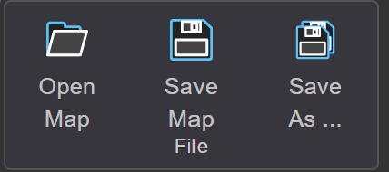
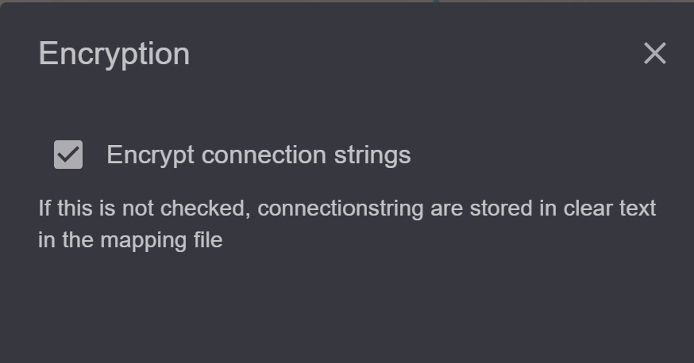

Speichern und Verwalten von Kartendokumenten
============================================

Zum Schluss sollte die Karte natürlich noch gespeichert werden. 
Dazu stehen in der Werkzeugleiste folgende Werkzeuge zur Verfügung:

Save
----

Speichert die aktuelle Karte. Existiert die Karte bereits, wird sie kommentarlos überschrieben.

Save As
-------

Hiermit wird eine Karte mit einem neuen Namen oder Speicherort gespeichert. 

Wird eine Karte mit ``Save As`` gespeichert, wird vor dem Speichern noch folgender Dialog angezeigt,
sofern man als Administrator angemeldet ist:

Normalerweise werden die Verbindungseigenschaften zu Datenbanken im MXL File verschlüsselt. 
Möchte man diese Eigenschaften in einem Texteditor ändern, kann durch die *Checkbox* bestimmt werden,
dass die Verbindungseigenschaften im Klartext gespeichert werden.

.. note::
   
   Aus Sicherheitsgründen sollten die Verbindungseigenschaften immer verschlüsselt werden.
   Allerdings ist auch diese Verschlüsselung nicht 100% sicher. *gView GIS* ist eine Open Source Software und
   jeder kann sich den Mechanismus dieser Verschlüsselung aneignen und umgehen.
   MXL-Dateien mit vertraulichen Verbindungseigenschaften sollten daher immer mit Sorgfalt behandelt
   und nicht weitergegeben werden.

.. note::

   Ist man Administrator und möchte die Verbindungseigenschaften (*ConnectionString*) von
   *Dataset* ändern, funktioniert das über den Button ``Map Datasets`` in der Werkzeugleiste:

   .. image:: img/save3.png

   Hier können *ConnectionStrings* ganz einfach mittels ``Edit`` und ``Save`` angepasst werden.
   Mit dem Button ``Compress/Clean`` können doppelte *Datasets* oder *Datasets* ohne zugehörige
   Layer aus der Karte entfernt werden.

Eine gespeicherte Karte im ``mxl`` Format lässt sich nahtlos über *gView Map Server*
publizieren.
