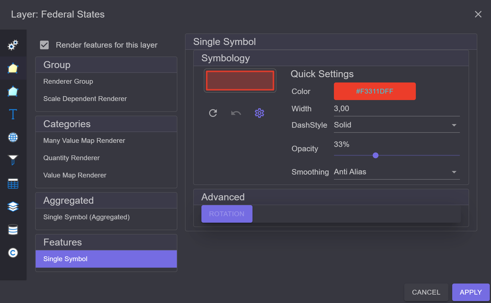
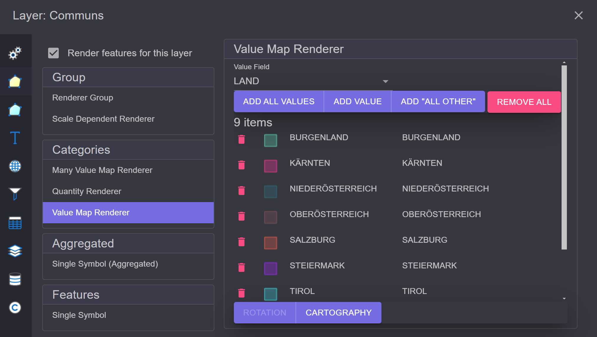
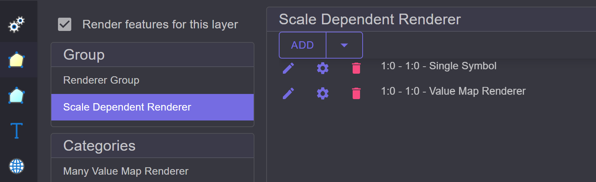

Feature Renderer
================

*Renderer* bestimmen, wie Layer in die Karte gezeichnet werden. Dabei geht es nicht um die 
Symbolik, sondern um die Logik der Darstellung:

* **Einfach:** Jedes Objekt (Feature) hat das gleiche Symbol.
* **Kategorisiert:** Objekte (Features) werden in Kategorien eingeteilt. Das kann über Attributwerte
  oder Wertebereiche erfolgen.
* **Renderer Gruppen:** *Renderer* können sogar gruppiert/kombiniert werden. Zum Beispiel kann
  ein Layer in verschiedenen Maßstabsbereichen unterschiedlich gezeichnet werden.

Um den *Renderer* festzulegen, wählt man den Layer im TOC aus und öffnet über das 
kontextbezogene Werkzeug ``Layer Settings`` den Dialog. Dort wechselt man (links) in den Bereich
``Feature Renderer``:

Simple Renderer
---------------

In diesem Beispiel ist der ``Simple Renderer`` voreingestellt. Dieser geht davon aus, dass für jedes *Feature* 
die gleiche Symbolik verwendet wird. Das entsprechende Symbol kann im rechten Bereich des Dialogs 
bearbeitet werden. 

Simple Renderer (Aggregated)
----------------------------

Ähnlich dem Simple Renderer. Allerdings werden hier die Features nicht sofort gezeichnet, sondern erst 
intern in einem *GeometryAggregate* gesammelt und dann gerendert. 
Der Renderer hat eher experimentellen Charakter. Der ``Simple Renderer`` ist zu bevorzugen.

Value Map Renderer
------------------

Ein weiter oft verwendeter Renderer ist der ``Value Map Renderer``. Dieser teilt die Features 
in Kategorien über Attributwerte ein. Dazu kann ein Attribut des Layers definiert werden.
Features mit demselben Attributwert werden mit demselben Symbol dargestellt.

Im Dialog (rechts) wählt man dazu zuerst das Attribut aus. Danach hat man über die 
Buttons unter der Feldauswahl mehrere Möglichkeiten, um Kategorien festzulegen:

* **Add all values:** Liest alle möglichen Kategorien aus dem Layer aus und erzeugt ein 
  zufälliges Symbol pro Kategorie.
* **Add value:** Manuelle Festlegung einer Kategorie.
* **Add "All Other":** Fügt eine ``All Other`` Kategorie hinzu. Damit kann man ein Symbol 
  für alle Features vergeben, die in keine der angeführten Kategorien fallen. Fehlt diese
  Kategorie, würden diese Features nicht gezeichnet werden.
* **Remove All:** Entfernt alle Kategorien.

Ein Beispiel wäre es, alle Gemeinden aufgrund des Bundeslandes, in dem sie liegen, unterschiedlich
darzustellen. Dazu wählt man hier einfach ``LAND`` als Feld aus und klickt auf 
``Add all values``:

In der Karte würde das Ergebnis dann etwa so aussehen:

.. image:: img/renderers3.png

Um ein Symbol im Renderer-Dialog zu ändern, reicht ein Klick auf das Symbol in der entsprechenden 
Kategorie. Damit wird die *Symbol Maske* angezeigt. Von dort ist es wieder möglich, den 
**Symbol Composer** zu öffnen. 
Eine einzelne Kategorie kann mit dem *Papierkorb*-Symbol gelöscht werden.

Am unteren Rand der Liste gibt es noch weitere Buttons:

* **Rotation:** Die Einstellung ist nur bei Punktthemen möglich. Hier kann angegeben werden,
  ob die Symbole aufgrund eines Attributwertes gedreht werden sollen. Dieser Button wird auch 
  beim ``Simple Renderer`` angeboten, wenn der Layer ein Punktthema ist. Angewendet wird die 
  Rotation nur, wenn ein ``Field Name`` angegeben wird:

  .. image:: img/renderers4.png
      :width: 300

* **Cartography:** Hier kann genauer bestimmt werden, in welcher Reihenfolge die Features gezeichnet 
  werden sollten. ``Simple`` zeichnet die Features in der Reihenfolge, in der sie aus der 
  Datenbank kommen. ``Legend Ordering`` zeichnet die Features anhand der Legende, sprich 
  jede Kategorie wird extra gezeichnet. Damit kann beispielsweise bewirkt werden, dass übergeordnete 
  Features immer über untergeordneten Features gezeichnet werden (Autobahnen über Landstraßen).
  ``Legend And Symbol Ordering`` berücksichtigt zusätzlich noch die einzelnen Symbolebenen 
  (**Symbol Stack** aus dem **Symbol Composer**):

  .. image:: img/renderers5.png
       :width: 300

Many Value Map Renderer
-----------------------

Der *Renderer* ist ähnlich wie der **Value Map Renderer**. Allerdings können hier bis zu 
drei Felder angegeben werden, die die Kategorie bestimmen:

.. image:: img/renderers6.png

Quantity Renderer
-----------------

Mit diesem Renderer werden die Features anhand von numerischen Wertebereichen kategorisiert,
beispielsweise aufgrund der Fläche. Eine einfache Möglichkeit, die Kategorien zu definieren, 
stellt der ``Wizard`` bereit:

.. image:: img/renderers7.png

Der *Wizard* ermittelt das Maximum und Minimum des Wertebereiches und vergibt dafür zufällige 
Symbole. Diese Werte und Symbole können hier noch manuell geändert werden.
Für die Zwischenschritte kann eine fixe Schrittweite oder eine fixe Anzahl an Schritten gewählt werden.

.. image:: img/renderers8.png

Klickt man auf ``Calc``, werden die Zwischenschritte berechnet und unten angezeigt. Entsprechen 
die Kategorien nicht den Vorstellungen, kann dieser Schritt so lange wiederholt werden, bis 
das Ergebnis stimmt. Danach kann der *Wizard* mit ``Close`` geschlossen werden.

Der Wizard versucht außerdem, einen fließenden Übergang zwischen den Anfangs- und Endsymbolen herzustellen:

.. image:: img/renderers9.png
    :width: 300

Scale Dependent Renderer
------------------------

Dabei handelt es sich um eine *Renderer* Gruppe. Hier können mehrere *Renderer* definiert werden,
die jeweils innerhalb definierter Maßstabsgrenzen angewendet werden.
Über das ``Add`` Menü können Renderer hinzugefügt werden:

Jede Zeile entspricht einem Renderer. Die Reihenfolge kann über das Ziehen mit der linken Maustaste 
geändert werden. 
Über das ``Edit`` Symbol (Stift) kann der entsprechende Renderer bearbeitet werden. Mit dem ``Löschen``
Symbol (Papierkorb) kann ein Renderer aus der Liste entfernt werden.
Über das ``Settings`` Symbol (Zahnrad) können weitere Einstellungen getroffen werden. Hier sind 
das die Maßstabsgrenzen innerhalb derer der *Renderer* angewendet werden soll:

Group Renderer
--------------

Entspricht im Prinzip dem **Scale Dependent Renderer** ohne Maßstabsgrenzen.

