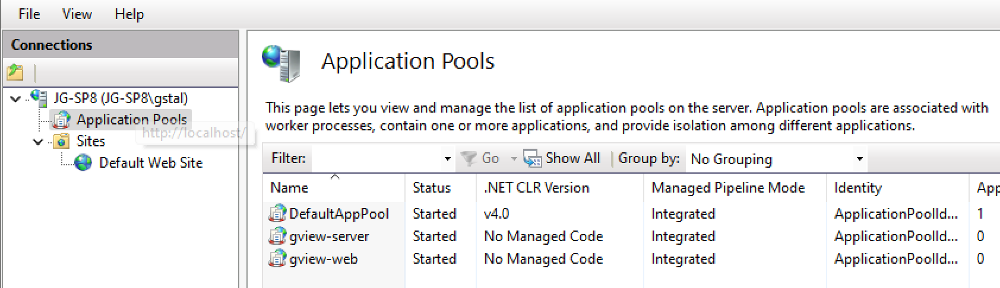
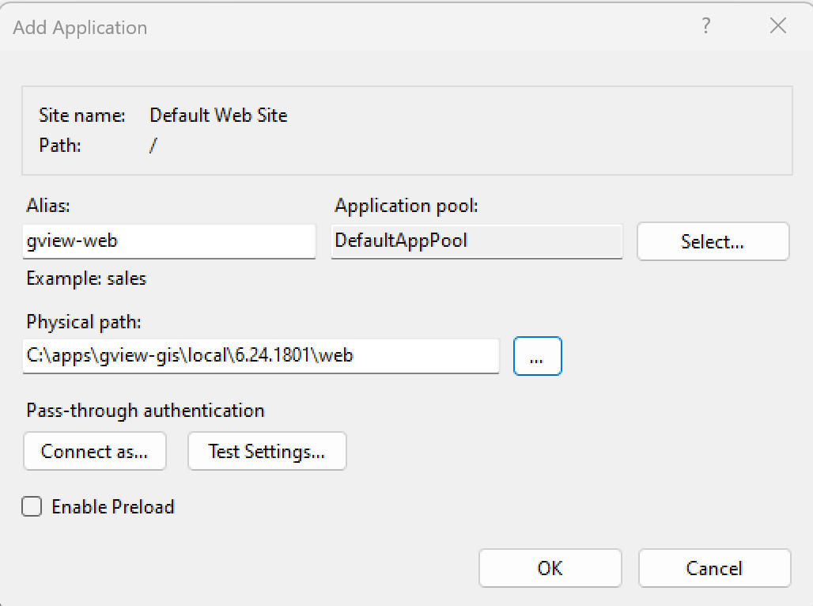
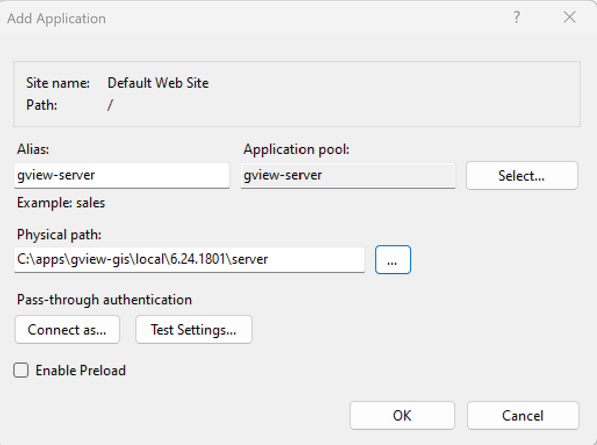
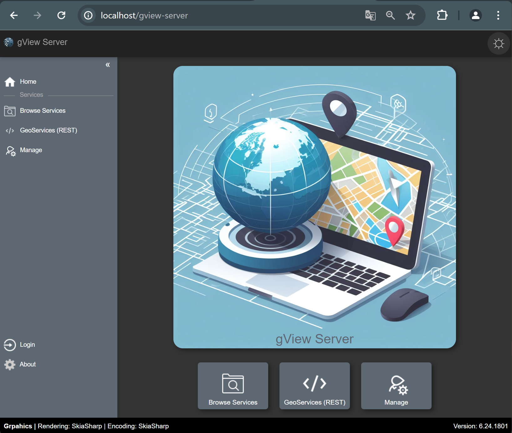

Running in Internet Information Server (IIS)
============================================

Both applications can also be hosted on a web server (e.g., IIS on Windows systems).

First, an *Application Pool* must be created for each application.

For **.NET CLR Version**, select ``No Managed Code`` and for **Managed Pipeline Mode** choose ``Integrated``.

In the next step, create a new application on the desired website 
(here ``Default Web Site``) (Right-click: ``Add Application...``):

Here, a name, the Application Pool, and the directory where the application was installed 
must be specified.

The *gView.Server* application can be created in the same manner:

The applications can be accessed at http(s)://`{host}`/gview-web or http(s)://`{host}`/gview-server:

.. note::

    If IIS applications do not start, it may be due to the **.NET Core Hosting Bundle** not being installed.
    If it is missing, ``dotnet-hosting-8.0.x-win.exe`` must be downloaded and installed from the **dotnet** download page.

   

