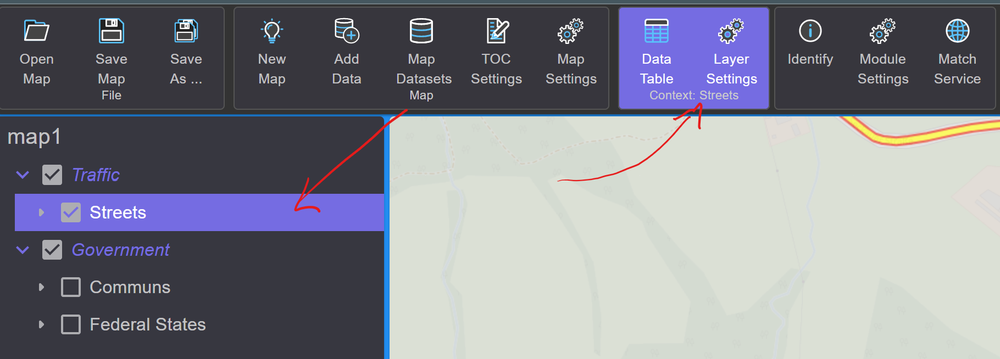
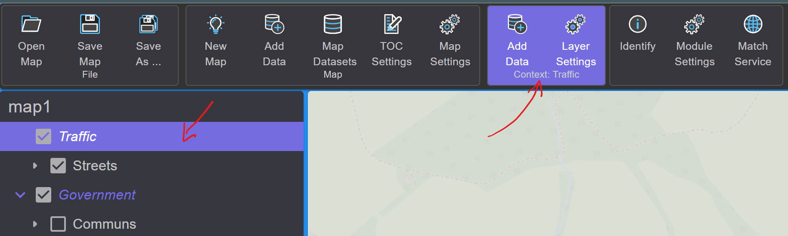

Context-Related Tools
=====================

Not all tools in the toolbar are static or always visible.
There are tools that relate to a specific context, for example,
to a layer that is currently selected in the TOC.

To select a layer in the TOC, simply click on it with the mouse.
The selection is highlighted in color. Additionally, new tools that relate to this layer 
also appear, highlighted in color:

For example, the following tools are displayed for *Feature Layers*:

* **Data Table:** Displays the data of the layer in a table format.
* **Layer Settings:** Opens the dialog for the layer's settings.

.. note::

    In the color-highlighted toolbox, the text ``Context: ...`` indicates
    which object (here Layer *Streets*) the tools relate to.

A group layer has some different context-related tools:

* **Add Data:** Corresponds to ``Add Data`` from the ``Map`` Toolbox. However, layers added here 
  are directly inserted into this group.
* **Layer Settings:** Group layers also have *Settings*. These can be managed here.
