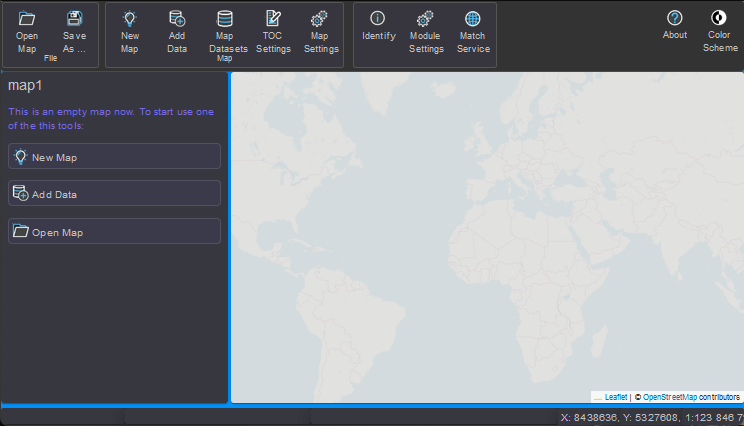

gView Carto
===========

The app **gView.Carto** is designed for creating and viewing maps. These
maps can be published on the **gView.Server** and are then available in various 
interface formats.

This section describes the process of map creation. The individual tools
will only be briefly mentioned or not at all. The goal is to be able to add data to a map and design the legends 
after reading this chapter.

After starting by clicking on ``gView.Carto``, the application initially displays an empty
map image with a transparent background *TileCache*. This background is not part of 
the actual map but serves only for orientation. If the map is saved and 
published on the **gView.Server**, this background is not included. The background
makes it easier to navigate the map, especially if the map later consists 
only of vector data.

.. toctree::
    :maxdepth: 2
    :caption: Table of Contents:
 
    newmap
    adddata
    toc
    contexttools
    symbology
    renderers
    labeling
    scales
    layersettings
    managemaps
