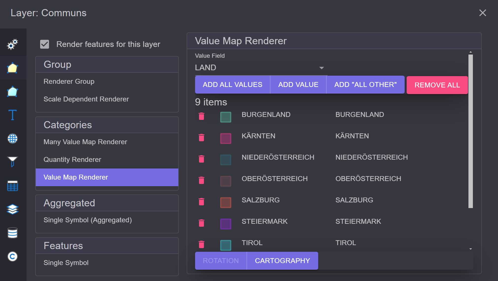
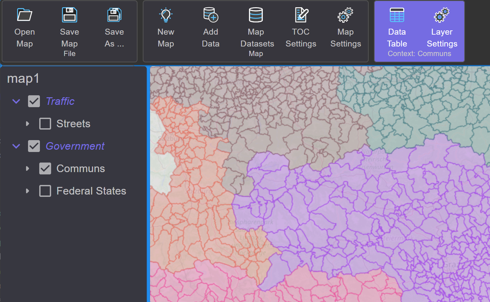
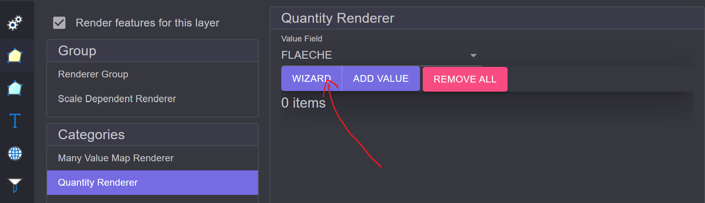
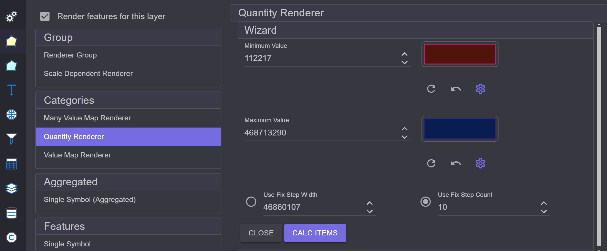

Feature Renderer
================

*Renderers* dictate how layers are drawn on the map. This is not about the symbolism but about 
the logic of the display:

* **Simple:** Every object (feature) has the same symbol.
* **Categorized:** Objects (features) are divided into categories. This can be done based on attribute values
  or ranges of values.
* **Renderer Groups:** *Renderers* can even be grouped/combined. For example, a layer can be drawn differently 
  in different scale ranges.

To set the *Renderer*, select the layer in the TOC and open the dialog via the context-sensitive tool 
``Layer Settings``. There, switch (on the left) to the section
``Feature Renderer``:

.. image:: img/renderers1.png

Simple Renderer
---------------

In this example, the ``Simple Renderer`` is preset. It assumes that the same symbolism is used for each 
*Feature*. The corresponding symbol can be edited in the right area of the dialog.

Simple Renderer (Aggregated)
----------------------------

Similar to the Simple Renderer. However, here the features are not immediately drawn but are first 
collected internally in a *GeometryAggregate* and then rendered.
This renderer has an experimental character. The ``Simple Renderer`` is preferred.

Value Map Renderer
------------------

Another often-used renderer is the ``Value Map Renderer``. This renderer categorizes features 
based on attribute values. An attribute of the layer can be defined for this purpose.
Features with the same attribute value are displayed with the same symbol.

In the dialog (on the right), first select the attribute. Then, using the 
buttons below the field selection, there are several options to define categories:

* **Add all values:** Reads all possible categories from the layer and creates a 
  random symbol for each category.
* **Add value:** Manually sets a category.
* **Add "All Other":** Adds an ``All Other`` category. This allows assigning a symbol 
  for all features that do not fall into any of the listed categories. Without this
  category, these features would not be drawn.
* **Remove All:** Removes all categories.

An example would be to display all municipalities differently based on the state they are in.
Simply select ``LAND`` (=STATE) as the field and click on 
``Add all values``:

On the map, the result would look something like this:

To change a symbol in the Renderer dialog, simply click on the symbol in the corresponding 
category. This will display the *Symbol Mask*. From there, it is possible to open the 
**Symbol Composer** again.
A single category can be deleted with the *trash can* symbol.

At the bottom of the list, there are additional buttons:

* **Rotation:** This setting is only possible for point themes. Here, it can be specified 
  whether the symbols should be rotated based on an attribute value. This button is also 
  offered with the ``Simple Renderer`` if the layer is a point theme. The rotation is only 
  applied if a ``Field Name`` is specified:

  .. image:: img/renderers4.png
      :width: 300

* **Cartography:** Here, it can be more precisely determined in which order the features should be drawn. 
  ``Simple`` draws the features in the order they come from the database. ``Legend Ordering`` draws the features 
  based on the legend, meaning each category is drawn separately. This can ensure that superior 
  features are always drawn over subordinate features (highways over country roads).
  ``Legend And Symbol Ordering`` additionally considers the individual symbol layers 
  (**Symbol Stack** from the **Symbol Composer**):

  .. image:: img/renderers5.png
       :width: 300

Many Value Map Renderer
-----------------------

This renderer is similar to the **Value Map Renderer**. However, up to 
three fields can be specified here that determine the category:

.. image:: img/renderers6.png

Quantity Renderer
-----------------

With this renderer, features are categorized based on numerical value ranges,
for example, based on area. An easy way to define the categories 
is provided by the ``Wizard``:

The *Wizard* determines the maximum and minimum of the value range and assigns random 
symbols for these. These values and symbols can still be manually changed here.
For the intermediate steps, a fixed step width or a fixed number of steps can be chosen.

When you click on ``Calc``, the intermediate steps are calculated and displayed below. If 
the categories do not meet expectations, this step can be repeated until 
the result is correct. Afterward, the *Wizard* can be closed with ``Close``.

The Wizard also attempts to create a smooth transition between the starting and ending symbols:

.. image:: img/renderers9.png
    :width: 300

Scale Dependent Renderer
------------------------

This is a *Renderer* group. Here, multiple *Renderers* can be defined,
each applied within specified scale limits.
Renderers can be added via the ``Add`` menu:

.. image:: img/renderers10.png

Each row corresponds to a renderer. The order can be changed by dragging with the left mouse button.
The corresponding renderer can be edited via the ``Edit`` icon (pencil). A renderer can be removed from the list 
using the ``Delete`` icon (trash can).
Further settings can be made via the ``Settings`` icon (gear). These include the scale limits 
within which the *Renderer* should be applied:

.. image:: img/renderers10.png

Group Renderer
--------------

In principle, this corresponds to the **Scale Dependent Renderer** but without scale limits.

