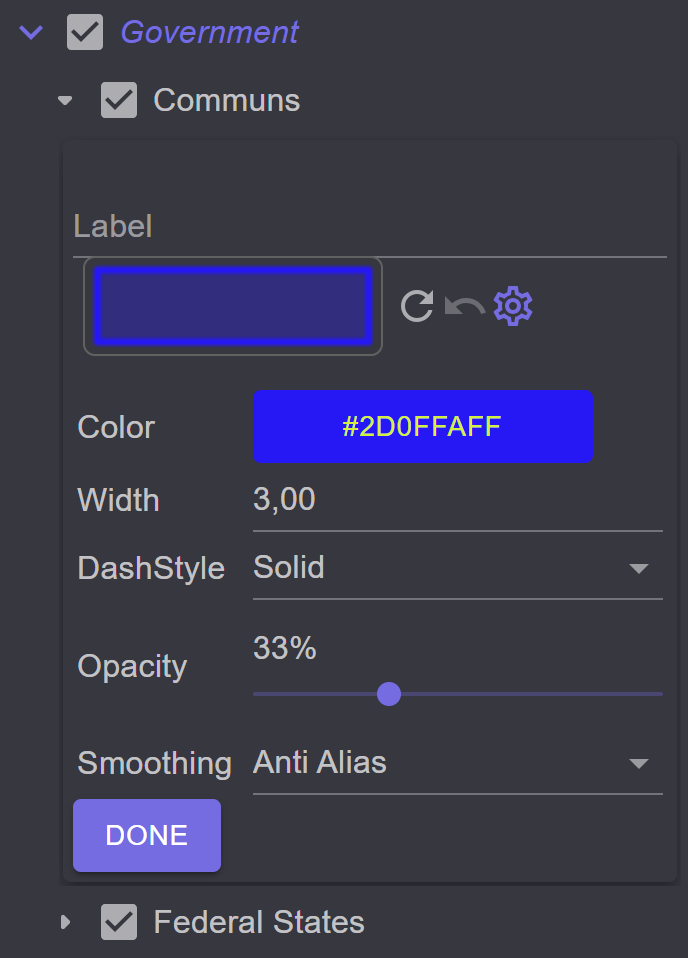
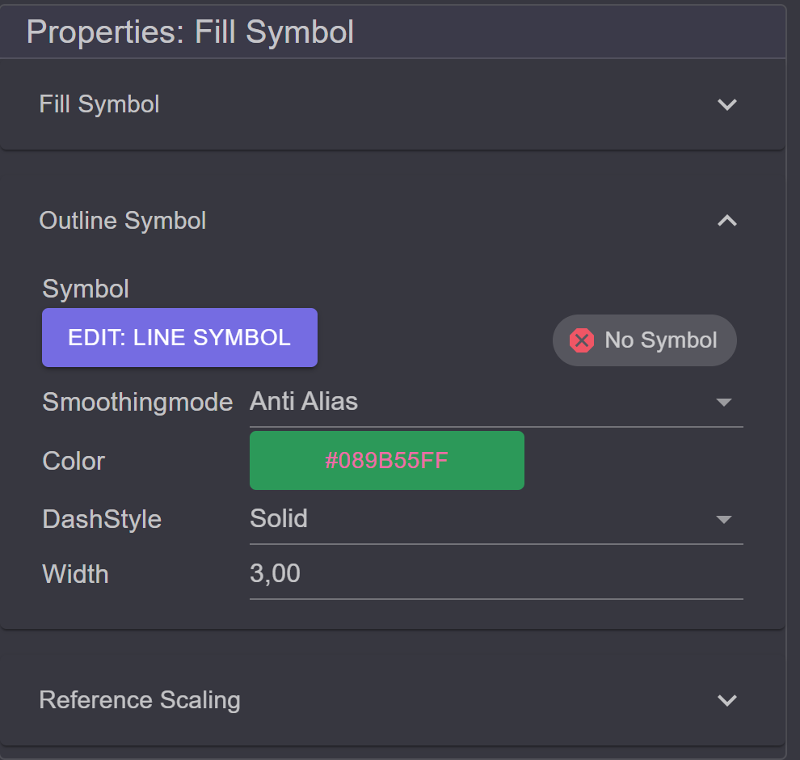
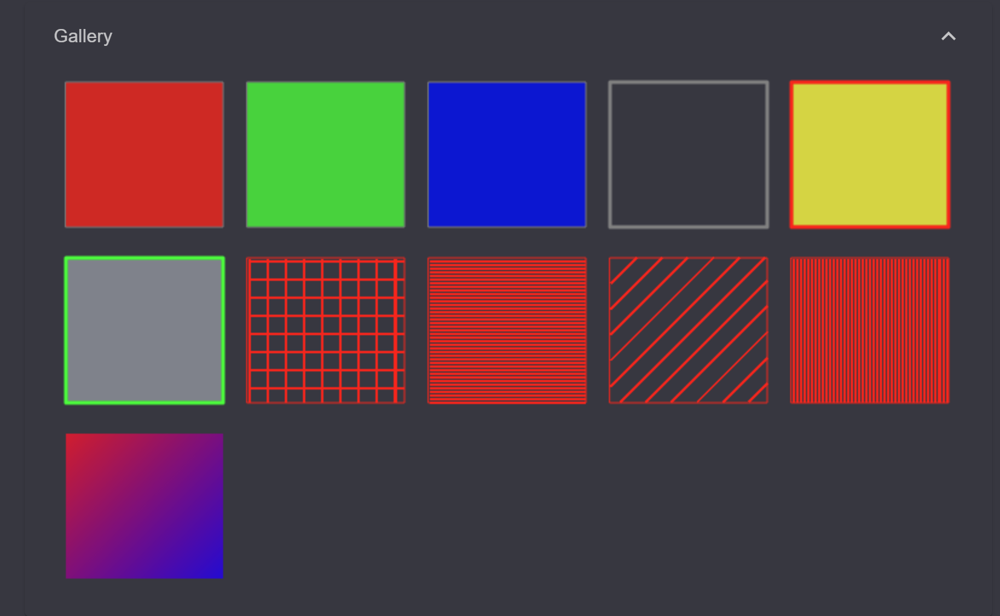
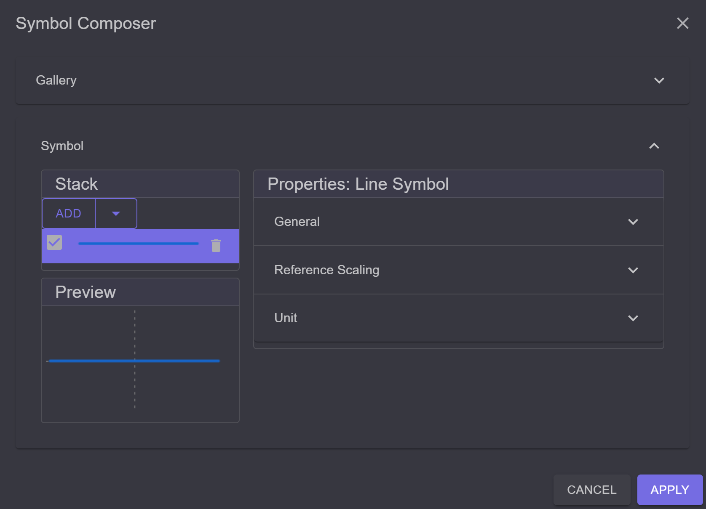
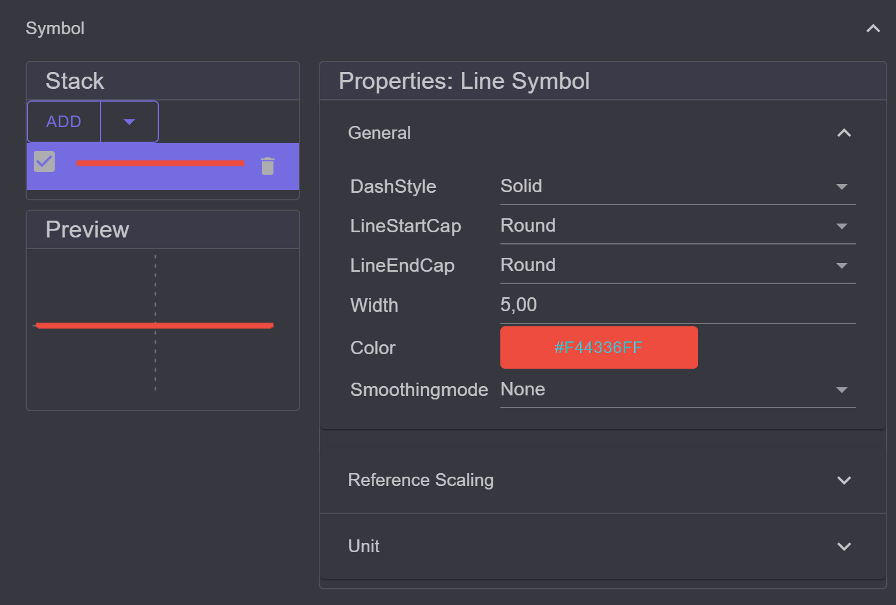
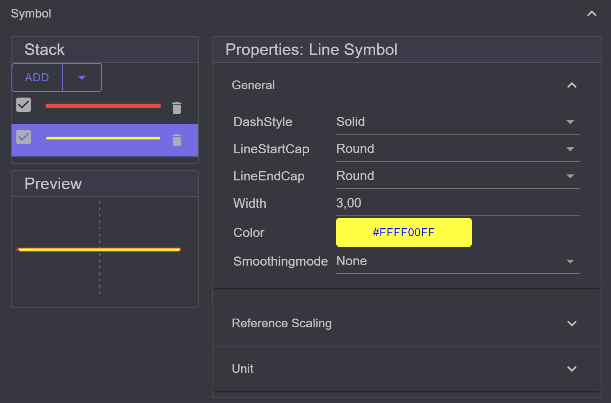
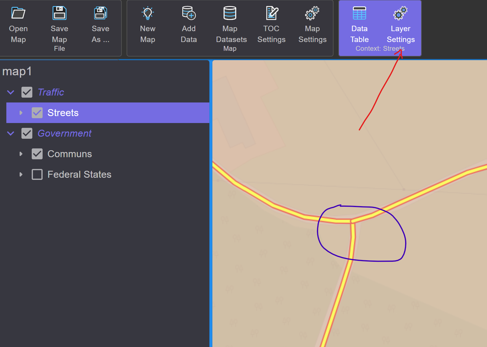

Representation and Symbology
============================

Here, we describe how the display of individual layers can be customized. In our example, 
municipalities should appear orange and roads in yellow and red. The simplest way to 
change a symbol is to double-click on the corresponding legend symbol in the TOC.
This opens a mask that displays the most important properties of the symbol:

For areal symbols, these include:

* ``Color``: The color of the symbol (clicking on the rectangle opens the color palette)
* ``Width``: The width of the line
* ``Dashstyle``: The style of the line (solid, dashed, ...)
* ``Opacity``: The opacity of the area
* ``Smoothing``: The smoothing mode (None, Antialias)

In the upper area of the mask, a label can be assigned for the legend symbol. Below it is the 
*Preview*, which changes immediately when a property is altered. Next to it are three buttons 
with the following tooltips:

* ``Create new random symbol``: Creates a new random symbol
* ``Undo``: Reverses the ``Create new random symbol`` command
* ``Symbol Composer``: The **Symbol Composer** allows for the creation of more complex symbols. 
   The **Symbol Composer** can also be opened by clicking on the *Preview*.

To apply the changes, the mask can be closed with ``Done``.

Symbol Composer
---------------

The *Symbol Composer* is similarly structured for all symbols.

.. image:: img/symbology2.png
   :width: 260

On the left, the symbol layers and the preview are displayed.
On the right, attributes such as color, line thickness, etc., can be specified for a symbol.
The attributes are usually thematically grouped. By clicking on a category,
the attributes can be edited.

In the ``Outline Symbol`` category, the properties of the outline of the area can be defined.
Here, the most common attributes are displayed again:

Some attributes can be changed via input fields and selection lists, while others offer one
or more buttons:
For ``Color``, clicking on the color opens the color palette.
The button ``Edit: Line Symbol`` opens the **Symbol Composer** for
the outline. If no outline is desired, the line symbol can be removed with
``No Symbol``.

In the upper area of the **Symbol Composer**, there is the ``Gallery``. Opening the
gallery with a click displays predefined symbols for the current geometry type:

When you click on a tile, it is adopted as a new symbol. If you want to add the displayed 
symbol to a stack of symbols, you must click on the ``+`` symbol that appears 
when you hover the mouse over the tile.

Before we describe the *Symbol Stack*, let's change the color of the 
area to orange and close the dialog with ``Apply``.

If the **Symbol Composer** was opened via the TOC, the symbol mask in the TOC must then be 
confirmed with ``Done``. After that, the map is redrawn with the changed symbol.

The same procedure can be followed for the line symbol for the *Streets* layer to open the 
**Symbol Composer**:

The goal is to create a yellow line with a red border as the symbol. The simplest way is to 
open the ``Gallery`` and select a symbol. For understanding, let's create the symbol without 
using this shortcut.

A line symbol can only ever display one color. There are no standard symbols for lined borders. The idea here is 
to draw multiple layers of symbols. First, a red line should be drawn, matching the width of the symbol. Then, 
a thinner yellow line can be drawn over it in the second step.

This can be done using the **Symbol Stack** in the **Symbol Composer**. Currently, there is one 
layer. Through the setting in ``General`` (right), the color can be set to red and the line thickness to 
``5``.

In the next step, add a new layer of the type ``Simple Line Symbol`` via the ``Add`` menu 
in the ``Stack`` section. A new line appears in the stack. To edit the properties of a 
symbol layer, it must be selected by clicking in the ``Stack``. For the new line, set the 
color to yellow and the line thickness to ``3``:

.. note::

    The drawing order of symbols occurs in the ``Stack`` from top to bottom. The first (topmost)
    layer is drawn first. The order of the layers can be changed by dragging with 
    the left mouse button.

    Individual symbol layers can be removed using the *trash can* icon.

We can now close the dialog with ``Apply``. If the symbol mask in the TOC is open afterwards,
it can be confirmed with ``Done``. The symbol representation on the map 
should now look like this:

In the intersection area of the road, you can see that the representation is not yet perfect.
The reason is that the individual objects are drawn one after another. Each object is considered 
separately, and both symbol layers are drawn for each object.

The behavior can be modified through the properties of the *Renderer*. A *Renderer* determines
which methods are applied when drawing objects. To change the properties of the *Renderer*,
the layer must be selected in the TOC. In the toolbar, tools highlighted in color appear, 
relating to the selected layer (see image above).

The render properties can be found under the ``Layer Settings`` tool. In the *Layer Settings* 
dialog, switch to ``Feature Renderer`` on the left:

.. image:: img/symbology9.png

There are different types of *Renderers*, and for this requirement, ``Single Symbol`` is selected.
This can initially be left as is. ``Single Symbol`` means that the same symbol (which 
can consist of several layers) will be used for all objects in the layer.

Important here is the ``Cartography/Ordering`` property. This property determines how the 
individual symbol layers are drawn:

* ``Simple``: Each object is considered and drawn individually. All symbol layers are drawn at once.

* ``Symbol Order``: The objects are drawn layer by layer. First, all objects are drawn with just the first symbol layer. Then, all objects are drawn again with the second 
  symbol layer, and so on.

If you select ``Symbol Order`` and confirm the dialog with ``Apply``, the result will look like this:

.. image:: img/symbology10.png

.. note::

    The symbology of a layer can also be changed via the **Layer Settings** dialog. 
    In the ``Feature Renderer`` section, symbols are displayed depending on the **Renderer**.
    Here, either the most important properties of the symbols can be set, as in the TOC symbol mask,
    or the **Symbol Composer** can be opened.
