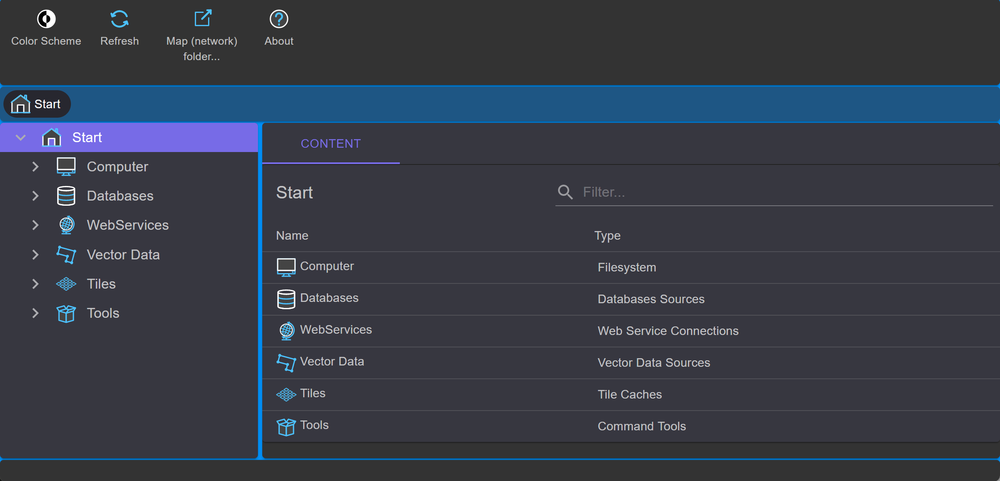

gView Data Explorer
===================

The program is comparable to Windows Explorer, but it is specifically designed for managing 
geospatial data. Upon launching, the following window appears:

On the left, the file system and connections to various data sources are displayed in a tree structure. 
The middle part of the window (*Contents*) always displays the content of the respective node.

.. toctree::
   :maxdepth: 2
   :caption: Inhaltsverzeichnis:

   connections
   fdb/index

